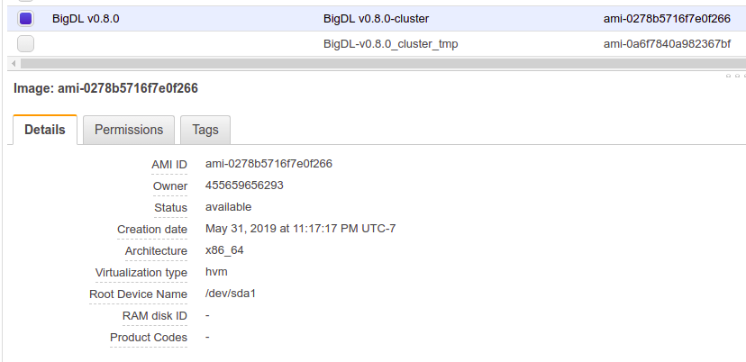
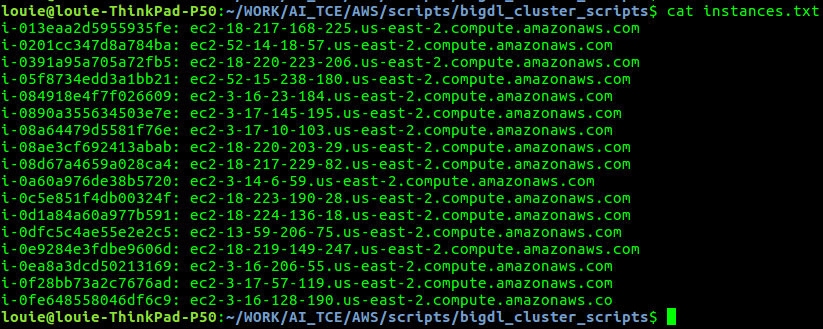
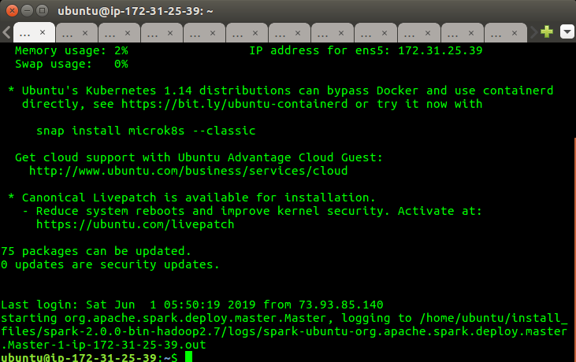
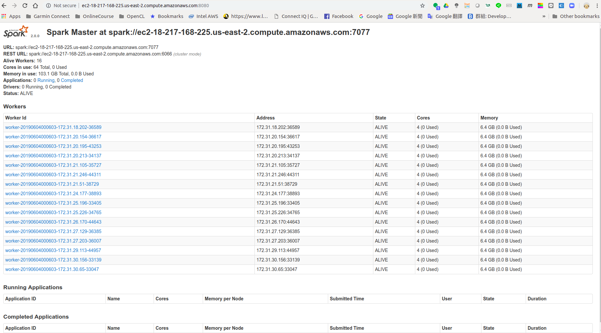
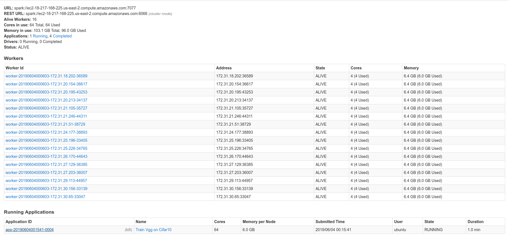
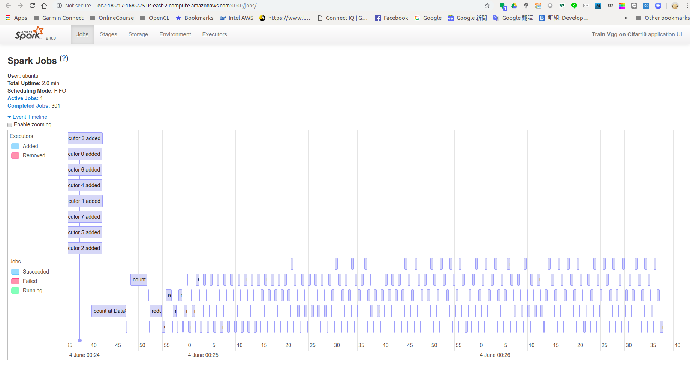
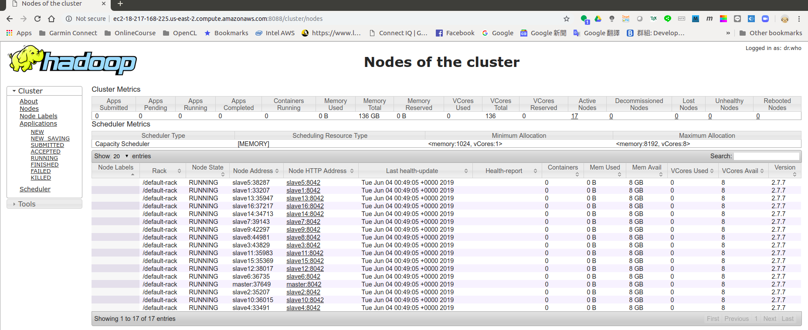

# BigDL_Cluster_Scripts

## Introduction

This python script helps users to deploy BigDL cluster automatically on AWS instances.
It is verified on Ubuntu, and depends on BigDL AWS AMI release from Intel.
Two cluster modes such as standalone and yarn are supported.

## Installation

1. git clone https://gitlab.devtools.intel.com/ltsai1/bigdl_cluster_scripts.git

## How to Use

### AWS instances for BigDL 

Users need to launch AWS instances from BigDL AMI image.

Current AMI ID : ami-0278b5716f7e0f266.

You can refer below diagram for related details of the AMI.

After AWS instances are launched, users need to get the IP or DNS list of those AWS instances.

By selecting the related AWS instances, users can get the lists from "Description" Tab like below diagram.

Users need to copy the contents of the "Description" tab into a file like "instances.txt", so this file contains the DNS list of AWS instances. 

Here is an example of the instances.txt .

### Spark Standalone Cluster

### Spark Yarn Cluster

