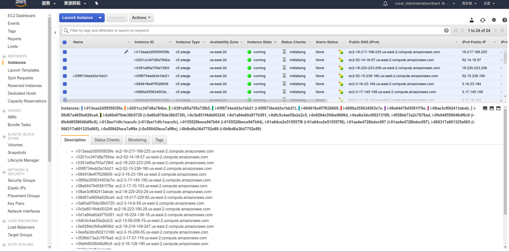

# BigDL_Cluster_Scripts

## Introduction

This python script helps users to deploy BigDL cluster automatically on AWS instances.
It is verified on Ubuntu, and depends on BigDL AWS AMI release from Intel.
Two cluster modes such as standalone and yarn are supported.

## Installation

`git clone https://gitlab.devtools.intel.com/ltsai1/bigdl_cluster_scripts.git`

## How to Use

### AWS instances for BigDL 

Users need to launch AWS instances from BigDL AMI image.

Current AMI ID : ami-0278b5716f7e0f266.

You can refer below diagram for related details of the AMI.

After AWS instances are launched, users need to get the IP or DNS list of those AWS instances.

By selecting the related AWS instances, users can get the lists from "Description" Tab like below diagram.

Users need to copy the contents of the "Description" tab into a file like "instances.txt", so this file contains the DNS list of AWS instances. 

Here is an example of the instances.txt.

### general usage

This python script uses instances.txt as the input to configure the cluster automatically.
Users can also select different cluster mode. The supported cluster modes are standalone and yarn mode.
For users under Intel internal network, the script also provides Intel proxy support.

| Option       | inputs                            | Description                                                  |
| ------------ | --------------------------------- | ------------------------------------------------------------ |
| -f, --file   | instances.txt , spark_cluster.csv | input file for AWS instances information. It can be raw input from AWS webpage like instances.txt or the generated spark_cluster.csv. the spark_cluster.csv is generated after the first run. |
| -c,--cluster | standalone, yarn                  | standalone mode from Spark or Yarn from Apache hadoop.       |
| -p, --proxy  | intel                             | support Intel internal network by using intel proxy          |

Example :

1. use saved instances list on spark standalone cluster mode under Intel network

   `python StartSparkCluster.py -f instances.txt -c standalone -p intel`

2. used generated csv file on spark yarn cluster mode

   `python StartSparkCluster -f spark_cluster.csv`

The script will configure the AWS instances into a spark cluster, and open the terminal with a ssh connection for each instance.

### Spark Standalone Cluster

`python StartSparkCluster -c standalone -f ...`

After auto-configuration, users can open a browser with http://MASTER_IP:8080.

users should be able to see the below webpage, and it shows all the worker nodes accordingly.

Once users launch a spark job, they should be able to see the running application information on the webpage.

### Spark Yarn Cluster

`python StartSparkCluster -c yarn -f ...`

After auto-configuration, users can open a browser with http://MASTER_IP:8088.

users should be able to see the below webpage, and it shows all the worker nodes accordingly.

